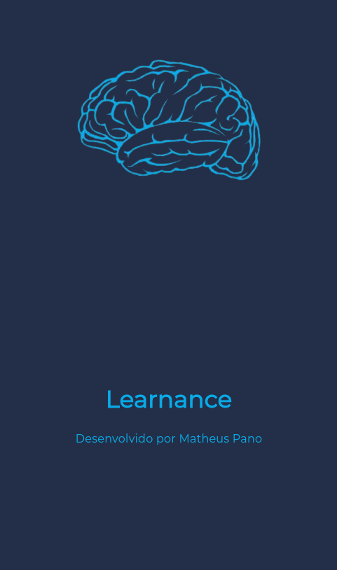
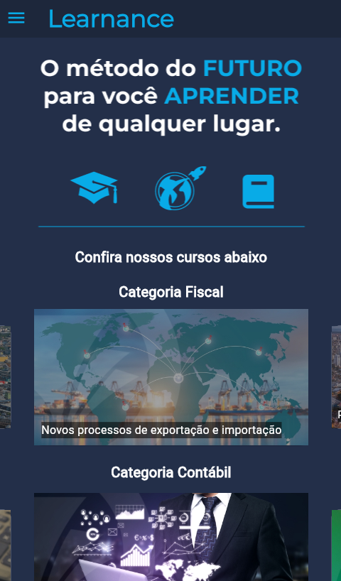
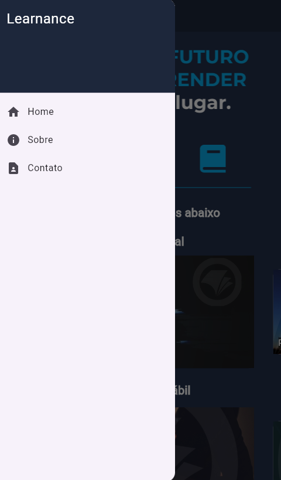

# Layout Mobile

## 📝 Sobre o projeto
Este projeto se trata da realização de um desafio proposto pela empresa CEFIS, como parte de um processo seletivo. Ele consiste na criação de um aplicativo baseado em uma LXP (Learning Experience
Platform).

## ✍️ Descrição do desafio
O seu usuário estará interessado em adquirir conhecimento através de cursos
online. Para ajudá-lo, o aplicativo deverá disponibilizar duas ações: visualizar os
cursos disponíveis em categorias e ver os detalhes de um curso.

## ⚛️ Tecnologias utilizadas
- Dart
- Flutter

## 💽 Como rodar o projeto
Para iniciar o projeto localmente realize um clone do repositório:
```
git clone https://github.com/MatheusPano/DesafioCefis.git
```

Para iniciar o projeto:
```
flutter run
```

Após rodar o projeto, escolha a melhor forma para você vizualizar pelo console e pronto:


## 💻 Preview do projeto

### Splash Screen


### Home Screen


### Detail Screen


### Drawer


